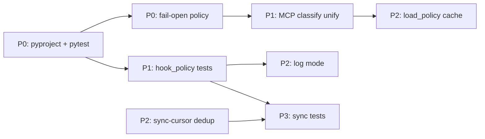

# Python Codebase Remediation — Overview

**Hub:** [USAGE.md](../USAGE.md) | **Scope:** `templates/hooks/policy/`, `templates/commands/sync-cursor.py`, `templates/hooks/tests/`

Implementation plans for remediation items from the Python codebase review (four files). **Planning only — no code in this pass.**

---

## Reviewed files

| File | Role |
|------|------|
| `templates/hooks/policy/hook_policy.py` | Shell DB/git + MCP classifier CLI |
| `templates/hooks/policy/sync_mcp_policy.py` | Seed `mcp_tools.json` from MCP descriptors |
| `templates/commands/sync-cursor.py` | Sync templates ↔ `.cursor/` ↔ global |
| `templates/hooks/tests/test_hook_policy.py` | unittest coverage for policy engine |

---

## Plan documents

| Document | Priority | Items |
|----------|----------|-------|
| [plan-python-remediation-foundation.md](plan-python-remediation-foundation.md) | **P0** | pyproject / pytest deps; fail-open vs fail-closed policy |
| [plan-python-remediation-hook-policy.md](plan-python-remediation-hook-policy.md) | **P1–P2** | MCP classification unification; hook_policy tests; cache + log mode; security hardening |
| [plan-python-remediation-sync-scripts.md](plan-python-remediation-sync-scripts.md) | **P2–P3** | sync-cursor dedup; sync script tests; logging |

---

## Rollout order (recommended)

1. **P0 foundation** — Unblocks CI, pytest, and typed Python 3.10+ features used in source (`Path | None`, `dict[str, Any]`).
2. **P0 fail-open policy** — Document and tighten error paths before expanding tests.
3. **P1 MCP unification** — Single source of truth before adding drift-detection tests.
4. **P1 hook_policy tests** — Cover gaps (main, force-push, overrides, heredoc, modes, Windows shlex).
5. **P2 hook_policy perf** — `lru_cache` + real `log` mode (depends on structured logging from P0).
6. **P2 sync-cursor dedup** — Refactor after tests exist to avoid regressions.
7. **P3 sync script tests** — Last; benefits from deduped helpers.

---

## Dependency matrix

| Item | Depends on | Blocks |
|------|------------|--------|
| P0 pyproject + pytest | — | P1 tests, P3 sync tests, CI |
| P0 fail-open policy | — | P1 tests (error-path assertions), P2 log mode semantics |
| P1 MCP classify unify | P0 pyproject | P3 `test_sync_mcp_policy.py` |
| P1 hook_policy tests | P0 pyproject, P0 fail-open | P2 cache/log, security fixes |
| P2 load_policy cache | P1 tests (cache invalidation tests) | — |
| P2 log mode | P0 structured stderr logging | — |
| P2 sync-cursor dedup | P1 hook_policy tests (smoke) | P3 sync tests (smaller surface) |
| P3 sync tests | P0 pytest, P2 dedup (preferred) | — |

---

## Cross-cutting issues

| Area | Current behavior | Risk | Addressed in |
|------|------------------|------|--------------|
| **Security: fail-open** | `main()` catches all `Exception`, returns `allow`; corrupt JSON in `_load_json` can raise uncaught in `load_policy` → caught by outer handler → allow | Destructive ops slip through on policy bugs | [foundation](plan-python-remediation-foundation.md), [hook-policy](plan-python-remediation-hook-policy.md) |
| **Security: corrupt policy JSON** | `json.loads` in `_load_json` without try/except | Engine crash or allow via outer catch | hook-policy plan |
| **Security: full-cmd scan** | `_sql_carrier_segments` appends full `cmd` when `argv[0]` is DB binary | False positives on shell wrappers (`psql … && rm …`) | hook-policy plan |
| **Security: delete_all_rows** | Pattern `(?i)\bdelete\s+from\s+\w+\s*;?\s*$` — misses `WHERE`, multi-table | Over-broad deny OR under-broad allow | hook-policy plan |
| **Security: log mode no-op** | `mode == "log"` returns `_allow_shell()` with no audit trail | Silent bypass of ask rules | hook-policy plan |
| **Logging** | No structured stderr in `hook_policy.py`; sync-cursor only prints `OK` lines | Unobservable policy failures | all three topic plans |
| **Performance** | `load_policy()` on every `classify()` call; subprocess per force-push check | Hook latency on hot paths | hook-policy plan |
| **Testing** | unittest + missing `fixtures/` dir; zero coverage on sync scripts | Regressions undetected | foundation + hook-policy + sync-scripts plans |

---

## Effort summary

| Workstream | Effort | Notes |
|------------|--------|-------|
| P0 foundation | **S** | pyproject + docs + CI one-liner |
| P0 fail-open policy | **M** | Design decision + stderr contract + shell wrapper alignment |
| P1 MCP unify | **M** | Extract shared module + sync script refactor |
| P1 hook_policy tests | **L** | Many cases + fixtures + optional pytest migration |
| P2 cache + log mode | **M** | Cache invalidation + log sink |
| P2 sync-cursor dedup | **M** | Careful refactor preserving four sync modes |
| P3 sync tests | **L** | tmp_path fixtures for all modes |

**Total (sequential):** ~3–5 dev days. **Parallel (2 engineers):** ~2–3 days (foundation + MCP unify in parallel with test authoring).

---

## Out of scope (this remediation)

- Rewriting PowerShell/bash hook scripts beyond stderr passthrough notes.
- Adding Poetry runtime deps beyond pytest dev group (stdlib-only scripts stay stdlib-only).
- Changing default policy semantics in `default.policy.json` without explicit product sign-off.

---

## Acceptance (program level)

- [x] `poetry run pytest templates/hooks/tests templates/commands/tests` passes on Python 3.10+.
- [x] `requires-python = ">=3.10"` in root `pyproject.toml`; README / HOOKS_USAGE updated from 3.7+.
- [x] Policy engine errors emit structured JSON on stderr; documented fail-open contract.
- [x] MCP prefix lists exist in one module consumed by `hook_policy.py` and `sync_mcp_policy.py`.
- [x] hook_policy coverage includes `main()`, force-push, overrides, heredoc, advisory/off/log modes, Windows shlex.
- [x] sync-cursor uses shared helpers (no duplicate agents/rules/skills/docs logic).
- [x] `test_sync_cursor.py` and `test_sync_mcp_policy.py` exist with tmp_path isolation.
