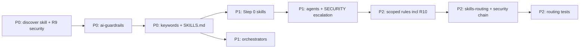

# Reuse Before Implement — Integration Plan

**Hub:** [USAGE.md](../USAGE.md) | **Scope:** `templates/rules/`, `templates/skills/`, `templates/agents/subagents/`, `templates/commands/routing/`

**Status:** [x] Done — implemented 2026-07-13. Evidence: `templates/skills/shared-practices/discover-before-implement/SKILL.md`, `templates/rules/ai-guardrails.mdc`, routing keywords, 789 tests passed.

**Reference:** [SKILLS.md](../skills/SKILLS.md) | [RULES.md](../rules/RULES.md) | [agents/subagents/AGENTS.md](../agents/subagents/AGENTS.md) | [plan-cursor-skills-routing.md](plan-cursor-skills-routing.md)

---

## Problem

Agents and skills today **sometimes** align with existing code (e.g. `design-feature-from-requirements` step 2, `implement-or-extend-api-surface`), but there is **no enforced discover → extend → create gate** before implementation.

| Layer | Current signal | Gap |
|-------|----------------|-----|
| **Rules** | `ai-guardrails.mdc` — do not invent APIs/paths; `clean-code.mdc` — DRY/YAGNI (in-file) | No mandatory repo search before new surface area |
| **Skills** | Fragmented "use existing patterns" in ~20 skills | No shared Step 0; scaffold skills skip "extend if present" |
| **Agents** | `fe_ux_design` designs before build; reviewers preserve UX | Implementation agents jump straight to output |
| **Routing** | `explain-codebase-structure` for navigation | Not wired as pre-implementation prerequisite |
| **Dependencies** | `assess-and-update-dependencies`, `security-scan-changes` exist standalone | Not chained when reuse implicates packages or security touchpoints |

**Risk:** parallel modules, duplicate utilities, redundant API routes, design-system forks, and platform re-scaffolds when `templates/ai-runtime/` or shared libs already cover the need.

**Security risk (not in v1 plan):** reusing internal modules or existing declared packages without checking **dependency CVEs** or **unsafe patterns** in the candidate (auth, crypto, deserialization, secrets) can inherit or amplify vulnerabilities.

---

## Definitions (do not conflate)

| Term | Meaning |
|------|---------|
| **Discover** | Search repo for existing function, module, component, hook, skill, template, or policy artifact |
| **Reuse (internal)** | Extend in-repo module, component, hook, or shared helper |
| **Reuse (dependency)** | Use a package **already declared** in the manifest (`pyproject.toml`, `package.json`, `go.mod`, etc.) instead of adding a new one |
| **Adopt (new dependency)** | Add a package not already in the manifest — requires security assessment before install |
| **Extend** | Add to an existing abstraction (endpoint, service, DS variant, shared helper) |
| **Configure** | Enable or parameterize existing capability without new code paths |
| **Wrap** | Thin adapter over existing module when interface mismatch is small |
| **Create** | New module/surface only when discover + extend/config/wrap fails or user explicitly requests greenfield |

**DRY / YAGNI** govern *how* code is written. **Reuse-first** governs *whether* new surface area should exist at all. **Security validation** governs *whether a reuse candidate is safe to inherit*.

---

## Policy precedence (after this work)

```
security / safety (security.mdc)
  → ai-guardrails.mdc (reuse before create)
    → discover-before-implement skill (when matched or implementing)
      → assess-and-update-dependencies (when packages implicated)
      → security-scan-changes (when reused code has security touchpoints)
        → domain skill (implement-or-extend-api-surface, etc.)
          → agent prompt (style / ownership)
```

**Tie-break:** YAGNI still blocks speculative extension points. Reuse-first blocks **duplicate** capability without justification. **Security blocks unsafe reuse** — prefer patch, alternative module, or create-with-safer-dep over extending a candidate with unresolved CRITICAL/HIGH CVEs or known unsafe API usage.

---

## Deliverables summary

| ID | Artifact | Priority | Status |
|----|----------|----------|--------|
| R0 | `discover-before-implement` skill (`shared-practices/`) | **P0** | [x] |
| R1 | `ai-guardrails.mdc` — reuse bullet | **P0** | [x] |
| R2 | `SKILL_KEYWORDS` + `SKILLS.md` catalog row | **P0** | [x] |
| R3 | Step 0 on implementation skills (see table below) | **P1** | [x] |
| R4 | Orchestrator Step 0 (FE, AI bot, RAG) | **P1** | [x] |
| R5 | Agent **Principles** line (implementation agents) | **P1** | [x] |
| R6 | `clean-code.mdc`, `code-review.mdc`, `architecture.mdc` tighten | **P2** | [x] |
| R7 | `plan-cursor-skills-routing.md` — reuse + security chain | **P2** | [x] |
| R8 | Routing tests (`test_routing.py`, hook `skills_matched`) | **P2** | [x] |
| R9 | `discover-before-implement` — dependency/security validation sub-step | **P0** | [x] |
| R10 | `code-review.mdc` — reuse inherits vulnerable dep check | **P2** | [x] |

---

## P0 — Constraint + shared skill (minimal viable gate)

### R0: New skill `discover-before-implement`

**Path:** `templates/skills/shared-practices/discover-before-implement/SKILL.md`

**YAML description (draft):**

```yaml
description: Search the repo for existing modules, utilities, components, hooks, skills, or platform templates before adding new surface area; validate security of reuse candidates (dependency CVEs, unsafe patterns); prefer extend, configure, or wrap over create. Use when implementing, adding, building, scaffolding, or creating endpoints, components, modules, shared helpers, or adopting dependencies.
```

**Workflow (canonical):**

1. **Scope** — What capability is being added (API route, UI component, test helper, hook, infra module, bot/RAG handler). Note whether the path implies **new packages** or only **internal** reuse.
2. **Discover** — Grep/Glob for names, patterns, and adjacent layers; read 2–3 best candidates; check `templates/` (especially `ai-runtime/`, `hooks/`, `skills/`) for platform artifacts. Check manifest(s) for packages that already provide the capability.
3. **Validate reuse candidates (security)** — Before deciding to extend/wrap:
   - **Internal candidate:** Identify security touchpoints (user input, auth/authz, crypto, deserialization, secrets, external I/O). If non-trivial → read/run **security-scan-changes** on the candidate module or planned diff scope.
   - **Dependency candidate (reuse existing declared package):** List implicated packages + versions from manifest/lockfile/imports. Read/run **assess-and-update-dependencies** for those packages (e.g. `pip-audit`, `npm audit`, `govulncheck`) — summarize CRITICAL/HIGH findings.
   - **Adopt new dependency:** Require **assess-and-update-dependencies** before adding to manifest; do not install without user confirmation per **suggest-commands-dont-run-destructive**.
   - **Block unsafe reuse** when: unresolved CRITICAL/HIGH CVE with no fix, known unsafe API (e.g. `pickle` on untrusted data, `eval` on user input), or unmaintained/abandoned package → escalate `@agent(SECURITY)` or choose `create` with a safer alternative.
4. **Decide** — `extend` | `configure` | `wrap` | `create` with one-line justification, including security posture (`proceed` | `proceed with mitigation` | `do not reuse`).
5. **Proceed** — Run domain skill only after decision and security check status are stated in reply or plan.

**Output contract:**

- Search terms / paths checked
- Best existing candidates (path + one line each)
- Packages implicated (name + version if known)
- Security validation status (scanned / recommended command / not applicable / blocked)
- Decision + justification
- If `create`: what was not reusable and why
- If blocked reuse: alternative path (patch dep, different module, new safer dep)

**Routing boundaries:**

- **explain-codebase-structure** — repo map / "where is X" (call when discover needs orientation)
- **audit-codebase-cleanup** — post-hoc duplication audit (not a substitute for discover)
- **design-feature-from-requirements** — design phase; discover skill runs before or feeds step 2
- **assess-and-update-dependencies** — CVE/outdated check when reuse implicates packages or before adopting new deps
- **security-scan-changes** — lightweight OWASP pass when reused internal code has security touchpoints
- **suggest-commands-dont-run-destructive** — list audit/install commands; do not apply dep changes without confirmation

**Notes:**

- Greenfield scaffold in empty repo: reuse **patterns and conventions**, not existing app code; still assess **new** deps before add.
- User override: `"new module, do not reuse X"` — document override, skip discover for that scope.
- Trivial internal reuse (pure formatting, no I/O, no secrets): skip full dep audit; optional quick scan only.

### R1: `templates/rules/ai-guardrails.mdc`

Add after **Ground truth** (or as sibling bullet under **Behavior**):

```markdown
**Reuse before create**: Before adding modules, endpoints, components, hooks, skills, or utilities, search the repo for existing equivalents (grep/Glob, README, `templates/`, shared libs, design system). Prefer extend, configure, or wrap. Validate reuse candidates for security (dependency CVEs via assess-and-update-dependencies; unsafe patterns via security-scan-changes when touchpoints exist). Do not extend code or packages with unresolved CRITICAL/HIGH vulnerabilities without explicit mitigation. Create new surface only when no safe fit exists or extension is higher risk — state what you searched and why create won.
```

**Acceptance:** Rule visible in always-applied set; `RULES.md` unchanged (always-applied table already lists `ai-guardrails`).

### R2: Routing + catalog

**`_keywords.py`** — add entry (distinctive phrases; avoid bare `"implement"` alone):

```python
(
    "discover-before-implement",
    (
        "implement feature",
        "add endpoint",
        "add component",
        "new module",
        "scaffold",
        "build ui",
        "shared utility",
        "reuse existing",
        "before implementing",
        "add dependency",
        "new package",
        "use library",
    ),
),
```

**`SKILLS.md`** — add under `shared-practices`:

| Skill | Triggers | Agent |
|-------|----------|-------|
| `discover-before-implement` | implement, add module, scaffold, reuse existing, add dependency | — |

**Acceptance:**

- `poetry run pytest templates/commands/tests/test_routing.py -k discover` (new case)
- `test_before_submit_prompt_records_skills_matched` — prompt `"implement new API endpoint"` includes `discover-before-implement` (optional co-match with `implement-or-extend-api-surface`)

---

## P1 — Wire Step 0 into workflows

### R3: Implementation skills — add Step 0

Insert **before** current step 1 in each skill:

```markdown
0. **Discover existing capability** — Run **discover-before-implement** (shared-practices). If extending, skip greenfield scaffold steps.
```

| Skill | Extra branch note |
|-------|-------------------|
| `implement-or-extend-api-surface` | Merge with existing step 1 "Locate existing API layer" — avoid duplicate prose |
| `create-fastapi` | If repo has API layout → extend; only scaffold on greenfield |
| `create-flask-api` | Same as FastAPI |
| `implement-accessible-ui-from-spec` | Check design-system components + page patterns first |
| `architect-frontend-state-and-cache` | Check existing query keys, stores, cache helpers |
| `implement-bot-gateway` | Check `templates/ai-runtime/`, existing gateway routes |
| `implement-retrieval-pipeline` | Check existing RAG handlers / `search_knowledge_base` wiring |
| `implement-rag-ingest-and-index` | Check corpus manifests and ingest jobs |
| `implement-ci-cd-pipeline` | Already has "Reuse existing cache…" — reference shared skill instead |
| `implement-terraform-modules` | Check existing modules/stacks |
| `implement-cloudformation-stacks` | Check existing stacks |
| `implement-prompt-eval-runner` | Check existing eval runners / CI jobs |
| `implement-human-handoff` | Check existing handoff adapters |
| `implement-ai-rate-limiting` | Check gateway middleware |
| `add-tests-for-change` | Keep "Locate existing tests"; add cross-ref to discover skill |
| `add-frontend-tests-for-change` | Same |
| `add-logging-to-code` | Check project logger / existing fields |
| `add-error-handling-to-code` | Check domain error types module |
| `fix-bug-systematically` | Check for existing fix patterns / duplicate bug sites |
| `design-feature-from-requirements` | Step 2 already maps — add explicit cross-ref at step 1 |

**Skills that do NOT get Step 0** (review-only, navigation, or post-hoc):

- `review-pull-request`, `review-frontend-code`, `audit-codebase-cleanup`, `explain-codebase-structure`, `trace-data-flow`, `reproduce-and-document-failure`, `validate-*`, `security-scan-changes`

### R4: Orchestrators — Step 0 before canonical sequence

| Orchestrator | Step 0 text |
|--------------|-------------|
| `orchestrate-frontend-delivery` | Discover existing DS components, page layouts, state hooks before UX step when implementation is in scope |
| `orchestrate-ai-bot-delivery` | Discover `templates/ai-runtime/`, existing gateway/session/policy artifacts |
| `orchestrate-rag-delivery` | Discover existing corpus, index, retrieval handlers |

Add to **Canonical sequence** as step `0` (discover) — renumber display only; keep skill names stable.

### R5: Agent prompts — one **Principles** line

**Implementation agents** (add to `**Principles**`):

> **Reuse first:** discover existing modules, components, and utilities; extend before creating parallel implementations.

| Agent file |
|------------|
| `backend_python_engineer.md` |
| `backend_go_engineer.md` |
| `fe_ui_engineer.md` |
| `fe_state_engineer.md` |
| `fe_design_system.md` |
| `devops_engineer.md` |
| `data_engineer.md` |
| `rag_engineer.md` |
| `ai_platform_engineer.md` |
| `sql_database_engineer.md` |
| `nosql_database_engineer.md` |

**Review / architecture agents** (inverse check):

> Flag reinvention of existing abstractions unless justified. Flag reuse that inherits vulnerable dependencies or unsafe patterns without mitigation.

| Agent file |
|------------|
| `code_reviewer.md` |
| `fe_code_reviewer.md` |
| `architecture_advisor.md` |

**Security agent** (escalation when discover blocks reuse):

> When reuse is blocked on CVE or unsafe API grounds, recommend patch path, alternative module, or safer dependency — do not silently proceed.

| Agent file |
|------------|
| `security_engineer.md` |

**Acceptance:** `validate-template-consistency` passes after agent edits; no model slug changes.

---

## P2 — Enforcement + routing docs

### R6: Scoped rules

**`clean-code.mdc`** — extend DRY bullet:

```markdown
**DRY**: Do not copy-paste logic. Reuse existing helpers, services, and components across the repo before adding parallel implementations. Extract shared behavior at the second justified reuse; do not abstract prematurely for one call site.
```

**`code-review.mdc`** — add checklist items:

```markdown
**Duplication / reinvention**: New code mirroring an existing module without extending it → WARNING unless justified in PR/summary.
**Reuse security**: Extending a module or dependency with known CRITICAL/HIGH CVE (no mitigation) or obvious unsafe API usage → CRITICAL. New dependency added without audit mention → WARNING.
```

**`architecture.mdc`** — after layered structure intro:

```markdown
**New modules**: Require a stated boundary. Prefer extending application/service layers over new top-level packages when capability already exists nearby.
```

### R7 / R10: `plan-cursor-skills-routing.md`

Add routing rules:

```markdown
- Implement / add / scaffold: `discover-before-implement` → primary domain skill (e.g. `implement-or-extend-api-surface`, `implement-accessible-ui-from-spec`).
- Design then implement: `design-feature-from-requirements` → `discover-before-implement` → domain implement skill.
- Reuse implicates packages (existing or new): `discover-before-implement` → `assess-and-update-dependencies` → domain skill.
- Reuse implicates auth/input/crypto/secrets/external I/O: `discover-before-implement` → `security-scan-changes` → domain skill (when touchpoints are non-trivial).
- Blocked on CVE / unsafe API: escalate `@agent(SECURITY)` before `create` alternative.
```

### R9: Security validation (part of R0 skill — acceptance)

| Check | When | Skill / tool |
|-------|------|----------------|
| Dep CVE audit | Reuse extends module using external packages; or adopt new dep | `assess-and-update-dependencies` (`pip-audit`, `npm audit`, `govulncheck`, etc.) |
| Code security pass | Reused internal module has security touchpoints | `security-scan-changes` |
| Release gate (existing) | Pre-deploy verification | `validate-pre-deploy` already references dep vulns — cross-link in discover Notes |

**Acceptance:** R0 SKILL.md includes step 3 **Validate reuse candidates (security)** and routing rows for both security skills; no duplicate prose in `assess-and-update-dependencies` / `security-scan-changes` bodies (cross-ref only).

### R8: Tests

| Test | Location | Assert |
|------|----------|--------|
| Keyword match | `templates/commands/tests/test_routing.py` | `"implement new endpoint"` matches `discover-before-implement` |
| Hook ledger | `templates/hooks/tests/test_log_resource_usage.py` | Optional: implementation prompt populates `skills_matched` |
| Skill shape | `validate-template-consistency` | New SKILL.md has Workflow + Output Contract + Routing |

---

## Rollout order



1. **P0** — Skill + always-applied rule + routing (smallest behavior change, testable via keywords).
2. **P1** — Step 0 on high-traffic implement skills + orchestrators + agents (coverage without touching all 64 skills).
3. **P2** — Review enforcement + routing prompt + tests (closes the loop).

**Parallel track:** P1 agent edits can run in parallel with P1 skill Step 0 edits (different files).

---

## Dependency matrix

| Item | Depends on | Blocks |
|------|------------|--------|
| R0 discover skill | — | R3 cross-refs, R7 routing text, R9 security sub-step |
| R9 security sub-step | R0 skill shell | R7 security chains |
| R1 ai-guardrails | — | — (can ship with R0) |
| R2 keywords | R0 skill name stable | R8 tests |
| R3 Step 0 skills | R0 skill path exists | — |
| R4 orchestrators | R0 | — |
| R5 agents | R0 (concept stable) | — |
| R6 scoped rules | R1 (wording aligned) | — |
| R7 skills-routing prompt | R0, R3 list finalized | — |
| R8 tests | R2 | — |

---

## Exceptions (document in skill Notes)

| Case | Treatment |
|------|-----------|
| Greenfield repo / empty API tree | Discover **conventions**; scaffold skills apply fully |
| Single-line bug fix | Skip full discover unless symptom suggests duplicate bug elsewhere |
| User: "new module, ignore existing X" | Document override; discover everything except X |
| Spike / throwaway POC | User must say so; otherwise reuse-first applies |
| `create-fastapi` on monorepo with sibling service | Reuse sibling patterns, not necessarily same package |
| Reuse internal module with vulnerable transitive dep | Do not extend blindly — patch/upgrade dep first or choose different path |
| Trivial internal reuse (formatting, no I/O) | Skip full dep audit |
| User adds dep despite audit findings | Document accepted risk; escalate `@agent(SECURITY)` for CRITICAL |

---

## Effort summary

| Workstream | Effort | Notes |
|------------|--------|-------|
| P0 skill + rule + routing + security sub-step (R9) | **M** | ~3 files + catalog; security routing in skill |
| P1 Step 0 (18 skills) | **M** | Mostly one-line cross-refs |
| P1 orchestrators (3) | **S** | |
| P1 agents (13) | **S** | One line each |
| P2 rules (3) + routing prompt | **S** | |
| P2 tests | **S** | 1–2 pytest cases |
| Sync to consumer `.cursor/` | **S** | `sync-cursor.py` / hook |

**Total:** ~1–2 dev days sequential; ~1 day with parallel skill + agent edits.

---

## Out of scope (this plan)

- Automated hook that **blocks** writes when duplicate module names detected (future `afterFileEdit` advisory only)
- LLM-based semantic duplicate detection
- Changes to user-level Cursor rules outside `templates/`
- Renaming existing skills (`implement-or-extend-api-surface` name already encodes extend)

---

## Test plan (implementation phase)

- [x] `poetry run pytest templates/commands/tests templates/hooks/tests -q` — 789 passed
- [ ] Manual: paste `"Add a new users API endpoint"` → ledger shows `discover-before-implement` in `skills_matched`
- [ ] Manual: run `discover-before-implement` workflow on a known duplicate scenario in a fixture repo
- [ ] Manual: reuse path that implicates `requests`/`axios`/similar → plan cites `assess-and-update-dependencies` and audit command
- [ ] Manual: reuse internal auth helper → plan cites `security-scan-changes` or documents "no touchpoints"
- [ ] `validate-template-consistency` on touched `templates/skills/**` and `templates/agents/**`

---

## Cross-refs

| Doc | Relationship |
|-----|--------------|
| [plan-cursor-skills-routing.md](plan-cursor-skills-routing.md) | Add implement-phase reuse chain (R7) |
| [plan-cursor-agents-routing.md](plan-cursor-agents-routing.md) | No change — agents unchanged for routing |
| [plan-ai-infrastructure.md](plan-ai-infrastructure.md) | Bot/RAG plans should assume Step 0 discover on `ai-runtime/` |
| [plan-python-remediation-sync-scripts.md](plan-python-remediation-sync-scripts.md) | Exemplar of "delegate to existing helpers" — cite in skill Notes |
| `assess-and-update-dependencies` (dependency-workflows) | CVE/outdated gate when reuse implicates packages |
| `security-scan-changes` (security-workflows) | OWASP pass when reused internal code has touchpoints |
| `security.mdc` | Always-applied dep/CVE baseline |
| `validate-pre-deploy` (release-workflows) | Pre-release dep vuln check — cross-link in discover Notes |

---

## Instructions for Cursor (execution prompt)

When implementing this plan, work **P0 → P1 → P2** in order. For each phase:

1. Edit `templates/` sources only (not consumer `.cursor/` directly).
2. Keep diffs minimal — Step 0 is a cross-ref line, not duplicated workflow prose.
3. Run full pytest suite before marking phase complete.
4. Update this file: flip `[ ]` → `[x]` per deliverable row and add evidence (commit or file path).

Do not paste full SKILL.md bodies into chat during execution — edit files in place.
